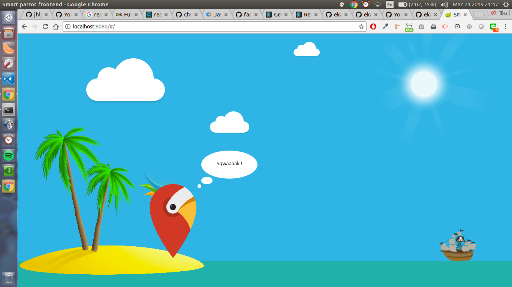

This project was intended for fulfilling HolidayPirates GmbH hackathon event

- Clone the project
- Run `yarn install` to install the dependencies
- Run `yarn serve` to run the development mode

## Testing

This project has e2e & unit testing installed in place and using jest for both tests

- Run `yarn test:unit` to run unit test
- Run `yarn test:e2e` to run e2e test
- Run `yarn test` to run both unit & e2e tests

